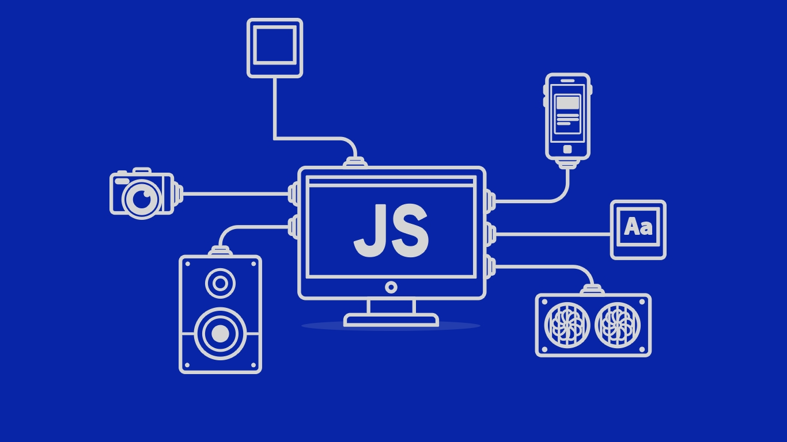

*You ever tried to remember every single thing that happened throughout your life?.*

For the 20 years I've been alive here on earth, I can tell you that I have a difficulty remembering most things. Although I can't speak for everyone alive, but at least 3/4 of the population have had some type of problem remembering certain things. If you're able to remember all the things in your life, I'll give you a dollar and a high five! 

Through the first semester of majoring in ICS, I struggled during written exams because recalling a body of code under pressure was very tiring and stressful. But over time I learned to accept that I can't always remember everything.

Now that I've been coding for 2 years, learning a new language isn't as difficult as the first time I learned a coding language. But I'll tell you, I still struggle with remember commands and procedures. 

## The Differences between Java and Javascript

I've coded through 3 different languages over my time as a Computer Science major and I gotta say the differences between them are quite microscopic. Especially if you compare Java and Javascript. Now I know by just looking at the names, you can tell that they will be very similar. There are still a few differences that will catch your eye when you code. I'm not gonna go through every single difference between the two, but if you ever find yourself learning Java and/or Javascript, I'll guarantee you'll notice it right off the bat. 

## Approval of Javascript?????

The short answer would be Yes! But giving it more thought, I'd say it all depends on the user. In my opinion if anyone who isn't a computer scientist wants to learn how to code, I would tell them to try javascript! I've been coding on javascript for almost two weeks now and I honestly believe that it is very easy to understand what you are trying to code. Just like Java, to truly know that Javascript is uncomplicated, I would have to code on it a little longer. 

## The workout of the Day and Night
 
I've worked on 4 different practice WODS and I gotta say it sure is a whole lot of fun. Just being in the pressure of figuring out a problem, it feels like an adrenaline rush knowing that you have to figure that specific problem out before the clock runs out. Although it sometimes made me angry that I couldn't finish the WOD, I usually just try again and again until I've completely mastered it. This type of learning is honestly very smart because it really tells you if you are decent enough or if you need a little more practice. I just hope that I will be able to consistently keep up with these daily WODs over time. 

## A reminder to remember this one

Being a junior in College isn't all that special, But I finally have started to see the many different opportunities I can be given through coding and real life experiences. I just hope that I can commit to those opportunities ASAP. To be honest, I really hate trying to seek those chances. But I really have to change that because I am not getting any younger. In a couple of semester I'll be officially graduating college and it'll be off to seeking a job fit for me. 

