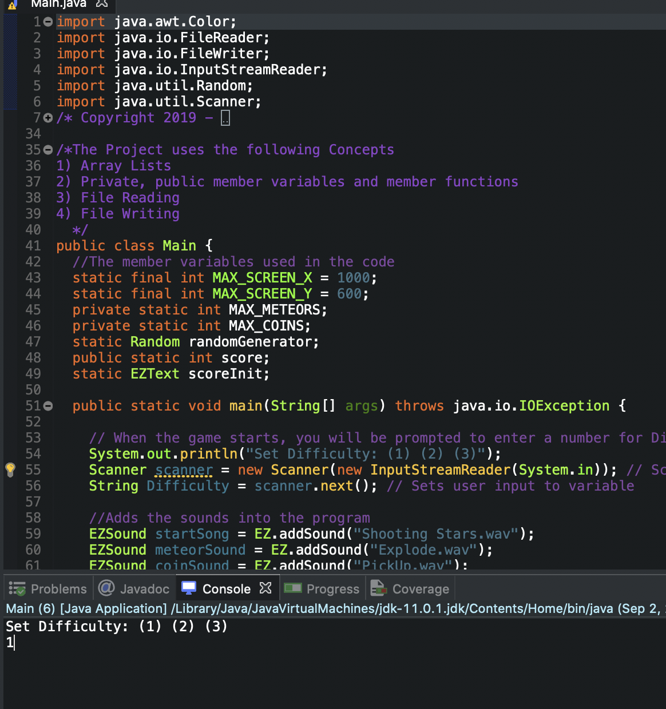
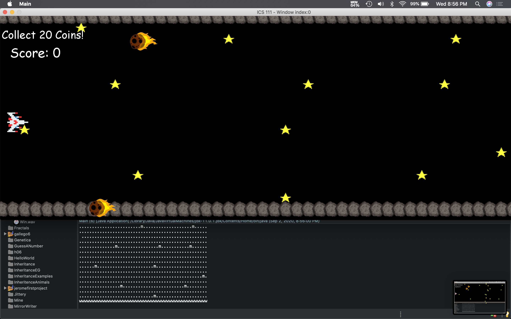
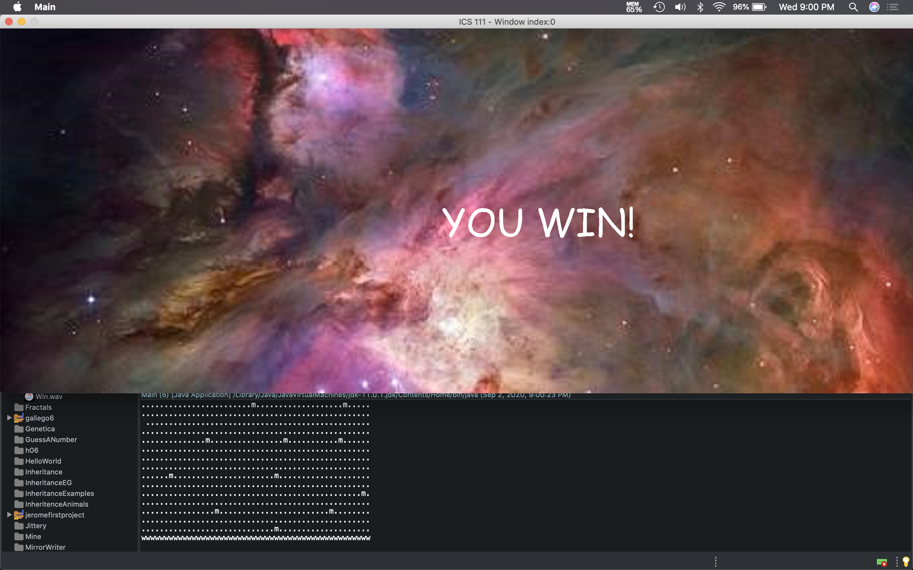

<div class="ui medium rounded images">
  
  
  
</div>

During my first semester as a student majoring in ICS, we were required to create a final project from scratch using Java and everything the professor had taught us. My group were a bit adventurous, so we decided to create a pirated version battlestar galactica. This project took about 2 weeks to figure out who will code the different classses. I'd say it was quite enjoyable creating our own game from scratch.

When you launch the game for the first time, it will prompt you with a question "What difficulty." There were 3 different difficulties, 1 being the easiest to 3 being impossible. The goal of this game is to collect the certain amount of points while dodging meteors that are coming right at you. As you advance to a harder difficulty, more and more meteors will charge at you at a faster speed. It's kind of like flappy bird when it comes to how frustrating and addicting it can be. 

The first step in creating this game involved coding the right background for the user to enjoy. We used stars and spacerocks to make it feel like you're in space. After that, we made sure to input all the different sounds that we would be using for this game. There were a total of 3 different java classes that need to be coded. So we seperated it to at least one person having to create a class. 

Here is some of the code I created to make this game functional:

```js
byte ADCRead(byte ch)
{
    word value;
    ADC1SC1 = ch;
    while (ADC1SC1_COCO != 1)
    {   // wait until ADC conversion is completed   
    }
    return ADC1RL;  // lower 8-bit value out of 10-bit data from the ADC
}
```


