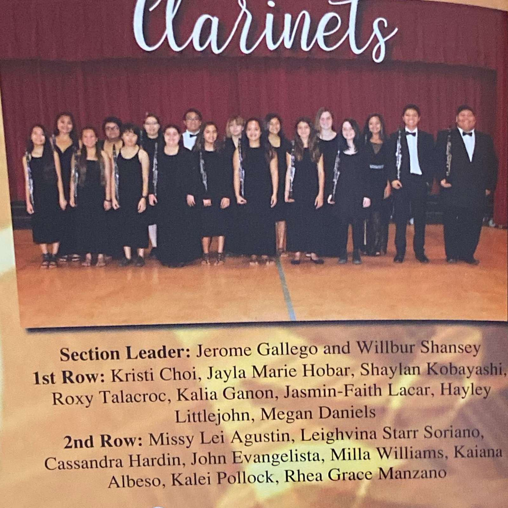

The first time I ever picked up an instrument was in middle school in the year 2012. I eventually became a band member for the rest of my 7-12 grade career. This took a lot of commitment because I was also in other clubs that required me to be there. Every week there would be band practice on Tuesday, Thursday and sometimes even on Friday. To be honest with you I kind of resented the fact that we had to stay an extra hour of school for band practice when I could have been at home finishing up my school work. But I forced myself to continue as a musician.

There was a lot to learn while being a musical artist. The main skill I needed to adapt was having the patience to keep on practicing until I was able to play the whole song without any issues. This can be accommodated for everyday living. Practicing really paid off because in my Senior year of college, I was awarded as one of the Section Leaders in a symphonic band. Section leaders is defined as being decent enough to lead the rest of the section. The picture on the right shows what instrument I played and how many people I had to teach. 

