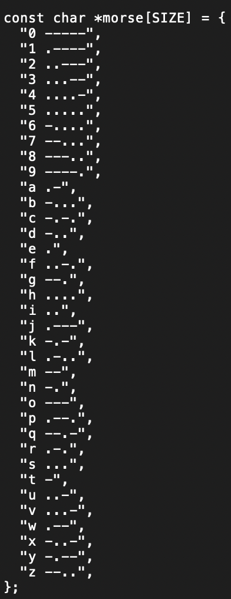

Last semester I was enrolled in ICS 212 and one project I created was a Morse Code Translator. It was a way to understand command line arguments and how to use array of pointers in a function. During that time coding in C/C++, I wasn't that efficient in the language. To store the different lines of morse code, I just used an array of pointers that can be implemented in the main program. Here's what it looked like:

 
 
 
When I reviewed my code earlier today, I think I want to try and make it a little more complex. So that if I input a sentence in english it will also return the sentence in morse-code. It'll be really cool if I can implement the code written into javascript so that I can create a website that anybody can use.

