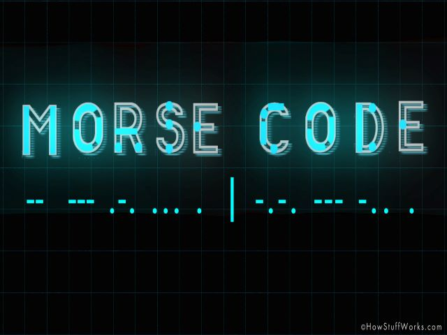

Cotton is a horror-esque text-based adventure game I developed using the functions and macros built from The Wizard's Game in [Conrad Barski's Land of Lisp](http://landoflisp.com/). Slightly more interesting and convoluted! (It is not that scary.)

