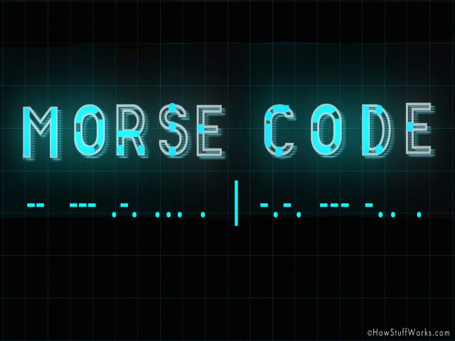

## What is Manoa Eats

Manoa Eats is a web application that targets all students and faculty of UH Manoa who are craving food but do not know what is available. You are given the ability to search for what vendors are on campus while also looking at what types of Entrée is available. I worked with Christine Guira, Yeji Han, and Marjorie Raquiz on developing this project. 

 
## Interested in Manoa Eats? 

If you want to learn more about all the features in ManoaEats you can go here 
 
When I reviewed my code earlier today, I think I want to try and make it a little more complex. So that if I input a sentence in english it will also return the sentence in morse-code. It'll be really cool if I can implement the code written into javascript so that I can create a website that anybody can use.

