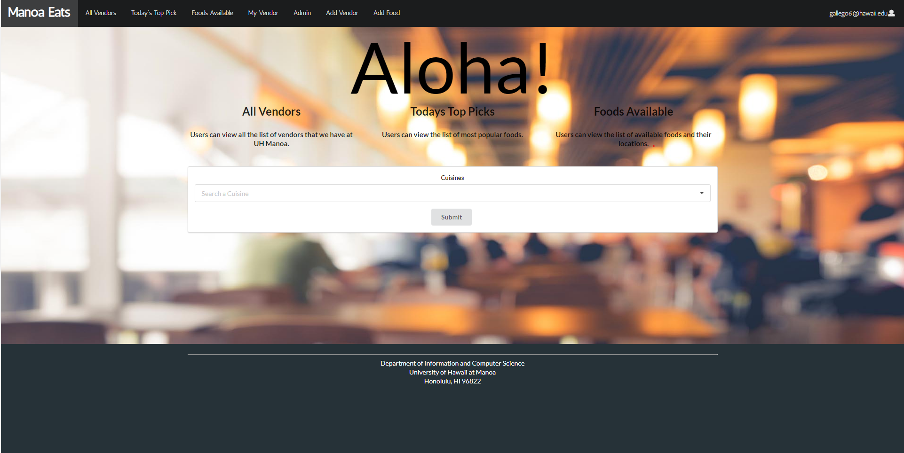

## What is Manoa Eats

Manoa Eats is a web application that targets all students and faculty of UH Manoa who are craving food but do not know what is available. You are given the ability to search for what vendors are on campus while also looking at what types of Entrée is available. I worked with Christine Guira, Yeji Han, and Marjorie Raquiz on developing this project. 

 
## Interested in Manoa Eats? 

If you want to learn more about all the features in ManoaEats you can go <a href="https://manoaeats.github.io/">here</a>.

You can also take a look at our source code if you are interested on how we developed it: <a href="https://github.com/manoaeats/manoaeats">Manoa Eats</a>.
 
## My Contribution to Manoa Eats

One feature that I was able to produce was the filter function on our home page.

All users are able to select certain cuisine that they are interested in and it will show you where you can get them from.

Another feature I was able to produce is the Admin Page. Admins are able to look at all the vendors and be able to delete or edit them without any verification. Admins are given a list of registered user on the web application. However, only registered admins have the ability to use this.

## What I've learned

First and foremost this project was very difficult and required a lot of time. Working on a project completely online required so much patience because of the fact that we couldn't really compare each others code if there was an issue. I've learned that you have to work with what you've got. You're basically wasting more time complaining on what you don't have rather than utilizing your time to improve your project. Overall I'd say this was a rollercoaster of emotions especially since we are still in a time of a pandemic. If I had the chance to start from the beginning, I would have wanted to start on it earlier so that we have more time to adjust some minor things in our project. 

