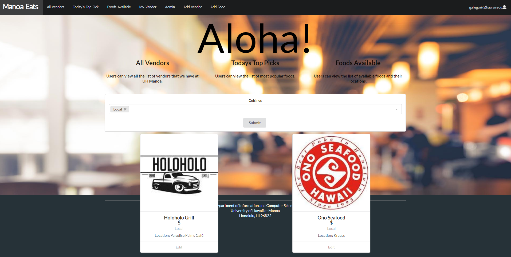

## Reflecting back on ICS 414 Software Engineering II

ICS 414 Software Engineering II expands our knowledge on developing a working website that can be used for normal day use. We collaborated with Hawaii Electric Industries on creating a working application that focuses on Green House Gases (GHG). Our group of about 7 students, called "Shocking Development" created a simple application that lets registered users log their choice of transportation everyday, which shows the user how much money they can save if they used different transportation rather than just driving to work. 
 
## Interested in Shocking Developments Application? 
Here is our github website: <a href="https://shocking-development.github.io/">here</a>.
Here is our github repository: <a href="https://github.com/shocking-development/shockingdevelopment">Shocking Development</a>.
 
## Contribution to Shocking Development

One feature that I was able to produce was the admin page for registered administrators.

Admin Users were able to view all registered users. They also have the ability to delete an account if a user wants it to be deleted. 

Overall this project required our whole group to be on the same page every time we met. Every person in our group had the ability to collaborate with one another which helped tremendously because I believe we wouldn't have gotten everything done without our teammates helping each other. 

## What I've learned

Looking back at the first day of ICS 414, I had some doubts on how I would be able to improve my software developing skills. However, there were a lot of things that I've learned throughout the semester. 

-One thing that I learned during the development of the application was how important it was to be organized on commiting your code into the master branch. Usually when you work alone on a project, you won't need to worry about issues when merging your code into github. But, when you have a group of more than 5 people, it becomes more complicated. You would need to notify every team member that your are going to merge your issue into the main branch. If a student merged an issue at same time as another student, that would cause confusion and a lot of frustration. Which no one wants in software development.  
-A skill that required everyone to have was: Communication. We all know that communication is the key to a successful experience. But, it gets difficult when all the work is being done online. For me, I strive when I talk to a group in person because it allows me to observe their reaction to ideas that I propose. Since this class was completely online we decided the next best thing was to create a discord server which acted as "Headquarters" for our group. This gave us the option to have specific days of when we can meet. For this project my group met every Wednesday and Sunday to recap and summarize what we have been working on recently. 

